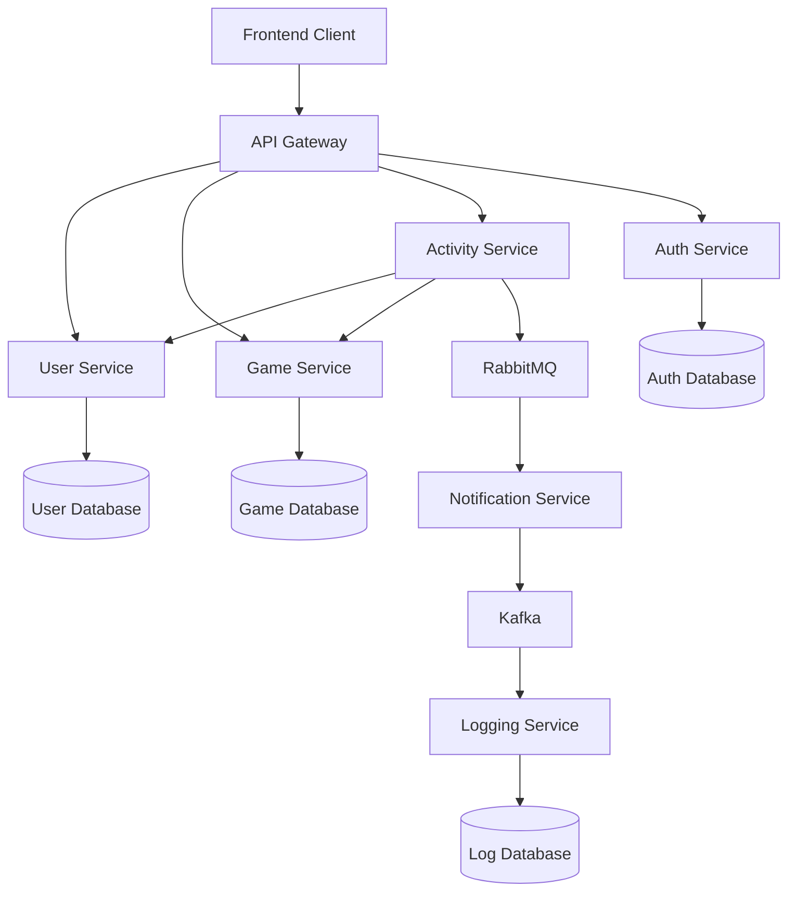

# GameHub Microservices Architecture

## Services

| Service | Responsibility |
|---|---|
| User Service | User profile management |
| Game Service | Game catalogue management |
| Activity Service | Aggregates user activity |
| Notification Service | Sends notifications |
| Auth Service | JWT authentication |
| Logging Service | GDPR compliant logging |
| API Gateway | Single entry point |

## Communication Methods

| Source | Destination | Method |
|---|---|---|
| Frontend | Gateway | HTTP |
| Gateway | Services | HTTP |
| Activity Service | User/Game Services | HTTP |
| Activity Service | RabbitMQ | Async Messaging |
| Notification Service | Kafka | Event Streaming |
| Kafka | Logging Service | Event Consumption |

## Database Ownership

| Service | Database |
|---|---|
| User Service | users.db |
| Game Service | games.db |
| Auth Service | auth.db |
| Logging Service | logs.db |